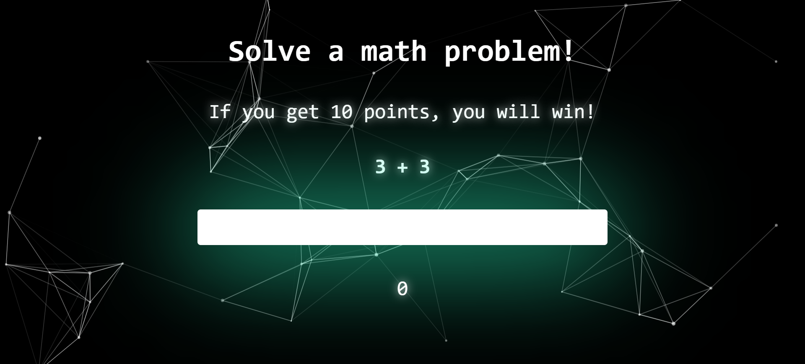
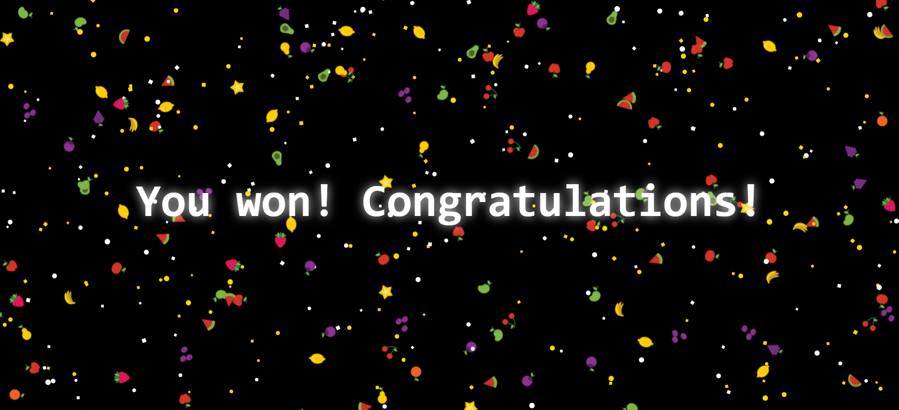

# Math Game! 

## A simple game to practice React

A player has to solve math problems (addition, subtraction, multiplication): 

As soon as the score is 10, the game finishes: 

The project has been done to practice the use of **React** and **Particles.js**. 